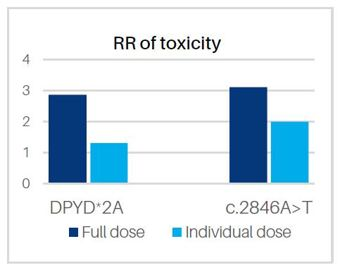
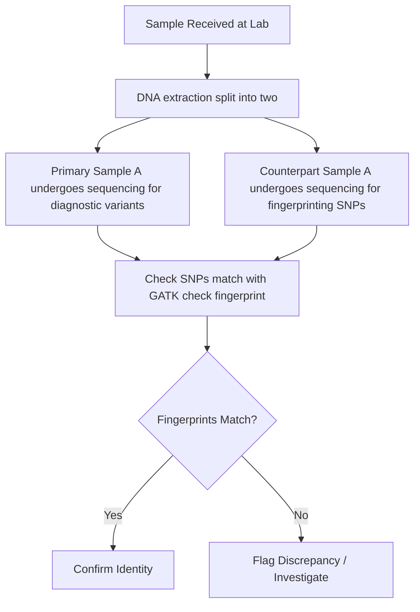

# Prac - screening clinical variants 

#### By Evelyn Collen


## **1. Intro to pharmacogenomic screening**

Pharmacogenomic screening (PGx screening) is a branch of genetic screening that looks at how specific genetic variants affect certain drugs. The tests usually look for genotypes that allow the optimisation of drug dosage and in some cases, avoiding specific drug types altogether for patients with variant types that are severely effected. Pharmacogenomics allows for precision medicine, rather than dosing out medicines blindly.  


### 1.1 Learning Outcomes

1. Learn about highly targeted testing/screening for pharmacogenomics
2. Learn about the importance of QC in reporting diagnostic variants out
3. Learn about how variants are prioritised in a clinical setting based on their effect on function
4. Learn about how clinical screening results are curated and reported out 
5. Learn about variant reporting in the DPYD gene


### 1.2 Pharmacogenomic screening panels for all types of drugs


As more variants get described in better resolution each year, and as we understand genes' function and create more drugs, there are more and more genotypes that we can test for, the products of which interact with all kinds of pharmaceuticals. Take a look at some of these pharmacogenomic tests offered by Fulgent:


[List of medications and associated genes:](https://fulgentgenetics.com/content/flyer/FLY-Meds_Associated_PGx_Focus-V1.pdf)


[Some info on pharmogenomic screening and reported variants:](https://dsvxqe97yr8mh.cloudfront.net/flyers/oncology/oncology-pgx/FLY-ONC_PGx_Variant-V2.pdf)


**Questions:**
1. Have a look at the the above link of medications and associated genes (link 1) of current tests offered by Fulgent. Are there any cancer medications?
2. Take a look at the list of variants tested for in the second link. You can see there's a few of them. What kind of test would you design for this, if you wanted to create a pharmacogenomics test - would it be exome, genome or amplicon?

<details>
<summary>Answers</summary>

1. Yes, there's a list of oncology medications on page 4. <br>

2. Exome sequences 2% of the genome, genome is the full 3 billion base pairs - these are too big! It would be better to do a small hotspot amplicon test that amplifies each of the specific variant sites.

</details>


### 1.3 About our dataset

Today we will be looking at four patients, who I have anonymised to Patient A, Patient B, Patient C and Patient D. There is a bonus Patient E, who has not been reported out, and you will eventually find out why. 

Patients A,B,C and D have had real diagnostic reports issued out for them, and you can have a look at the anonymised versions here. [DPYD patient reports](images_and_refs/Patient_reports.docx)


### 1.4 A note on variant naming 

There are a few standards that allow us to name variants in a standardised way so clinicians, bioinformaticians, lab staff, medical scientists can all speak the same language. 

RsIDs are one way - where each variant is given a number, called is rsID number. These are usually used for SNVs.

HGVS is the most accepted clinical standard - there's a few different ways to do it which later if you have time, you can browse through: [HGVS nomenclature:](https://hgvs-nomenclature.org/stable/recommendations/DNA/substitution/)

For example, below you see first the transcript, and then the position in the cDNA (base 9345), and the G has been substituted with a T:

NG_012232.1:c.9345G>T

## **2. DPYD pharmocogenomic screening **

The DPYD gene is responsible for generating the dihydropyrimidine dehydrogenase (DPD) enzyme, which plays a key role in the metabolism of toxic compounds. Deficiency in this enzyme can cause fatal toxicity to fluoropyrimidine chemotherapy treatments (e.g., 5-fluorouracil, capecitabine), which are widely used in the treatment of solid tumour cancers. Certain variants in the DPYD gene can impair functionality in the DPD enzyme's function. Depending on the impact of the variant on the metabolism activity of the enzyme, variants categorised into zero, decreased, or normal function. 

It's very important to optimise the variant-tailored dosage, as the standard dose that is effective for some people can be fatal for certain variant carriers. Severe toxicity to these drugs occurs in about 10% to 40% of patients, and around 7% of Europeans carry some variant that impairs function. In South Australia, there has unfortunately been a recorded case of patient fatality due to DPD enzyme deficiency and an incorrectly tailored dosage for that patient's genotype (i.e., it was assumed that the patient carried the most common genotypes, for which metabolising the drug at the prescribed dosage would have been fine).

This kind of testing really highlights the importance of QC and making sure every variant that gets reported out for our patients is as close as possible to accurate as possible. We do everything in our power to keep the margins of error as low as we can, to promote the best patient outcomes.




Figure 1. The relative risk of toxicity in those with specified variants when treated with full or individualised dose (taken from [Sonic Genetics](https://www.sonicgenetics.com.au/))

You can see in above diagram, DPYD*2A is the name of a particular variant that a percentage of the population carries, and its risk is much higher for a standard dose than an individualised dose. The same is true for the c.2846A>T variant. 


### 2.1 **DPYD metabolism categorisation based on variant type**

Depending on the configuration of variant alleles, and whether those alleles have zero, decreased or normal function, patients will receive a metabolism rating. Have a look at how the rating is worked out in this [DPYD metabolism rating table](images_and_refs/DPYD_metabolism_rating_and_recommendations.xlsx)

[DPYD patient reports](images_and_refs/Patient_reports.docx)


1.  Referring to the DPYD metabolism table, what DYPD phenotype would be given to a patient who has 1 normal function allele and 1 decreased function - i.e., would you classify their phenotype as normal, intermediate or poor?
2. Skimming through the DYPD patient reports, which patient actually has TWO different decreased function variants that are both classified as poor metabolisers? 

3. If you had to guess, what kind of dosage would likely be given to Patient B (i.e., normal or decreased dosage?)

4. True or false? Patient C has a homozygous c.2846A>T variant.
 
<details>
<summary>Answers</summary>

1. Their DYPD phenotype would be classified 'Intermediate metaboliser' <br>

2. Patient B has two variants <br>

3. Probably at least a minimum dosage or even an alternative therapy <br>

4. False, Patient C has a heterozygous variant c.2846A>T <br>

</details>


## **3. For any clinical testing - quality control is a must! **
`

### 3.1 Screening many patient samples and maintaining sample integrity

For every patient sample we receive, it needs to undergo a huge amount of QC checks at every level - e.g. does the sample have genetic attributes that we expect, has the sequencing performed to an acceptable standard, does the sample have enough quantity and quality of data, have the variants been called correctly?

If you remember from the lecture - the throughput of NGS samples going through clinical laboratories is really high. But how can we guarantee that no sample has been swapped or contaminated with another? Especially for the DPYD samples, it is super crucial to get the right variant reported out - it could be life or death. 

One way is to separate the sample into two, right at the beginning when the lab first receives the sample. The first part of the sample goes through the normal testing process, and we generate data for it. The counterpart goes through a completely independent workflow, where we target just a handful of common SNPs.




Let's start by looking at the results of running a fingerprint check for Patient A. The counterpart vcfs we will be checking against have been produced completely indepedently from our diagnostic vcfs (so they won't have any variants in the DPYD gene). 


```mermaid
flowchart TD
    A1[Patient_A.vcf.gz (diagnostic variants)]
    A2[Patient_A_counterpart.gatk.hg38.vcf.gz (contains 72 fingerprinting SNPs)]

    A1 --> F[Check SNPs match with GATK check fingerprint]
    A2 --> F
```

With the fingerprint checking command, we compare the main vcf of Patient A - that contains all the diagnostic data (Patient_A.vcf.gz) to its fingerprinting counterpart vcf (Patient_A_counterpart.gatk.hg38.vcf.gz). The counterpart vcf only contains 76 SNPs (single nucleotide polymorphisms). A reminder that SNPs are like 'hotspots' of variation in the human genome, so most people will carry some variance at these positions. If we find that the variance in both vcfs across these 76 SNPs is close to identical - barring some noise - then we know with confidence that the data we are looking at indeed belongs to Patient A, and the sample integrity check passes. 


Below is the command we would run using a program called GATK on commandline, to check both: 

```bash
gatk CheckFingerprint -R 4_refs/Homo_sapiens_assembly38.fasta -I Patient_A.vcf.gz --GENOTYPES Patient_A_counterpart.gatk.hg38.vcf.gz --HAPLOTYPE_MAP 4_refs/HaplotypeMap.vcf --GENOTYPE_LOD_THRESHOLD 0 --SUMMARY_OUTPUT output/1_fingerprint_check/Patient_A.fingerprint_summary.tsv --DETAIL_OUTPUT 3_reports/1_fingerprint_check/Patient_A.fingerprint_detailMetrics.tsv
```


In the output file, we can find the LOD score for Patient_A: LOD = 19.548716624813856. 

[Patient A fingerprinting output](outputs/1_fingerprint_check/Patient_A.fingerprint_summary.tsv)


The LOD score, or LL_EXPECTED_SAMPLE (log-likelihood) in the output, is the core metric in this output. It represents the base-10 logarithm of the likelihood that, based on genotype similarity of the SNPs, the counterpart sample is an identical match to the primary sample, versus a random sample.
Positive Value: The counterpart sample matches the primary sample (e.g., a LOD of 6 means it is \(10^{6}\) or 1,000,000 times more likely to be a match than not). Generally, anything above a threshold of LOD=6 we consider to have passed the integrity check (that means it's a 10^6 chance that the matching sample comes from the same patient, rather than a random person - that's some pretty good odds!)
Negative Value: The counterpart sample does not match the primary sample, indicating a potential swap or contamination.
Near Zero: Inconclusive result, usually due to low coverage or non-informative genotypes.


### 3.2 Checking sample integrity output

We ran the above command on all 5 of our patient samples here - Patient A, B, C, D and E.

Have a look at their results in the output folder [outputs/1_fingerprint_check](outputs/1_fingerprint_check/) - you will see they are all called Patient_{x}.fingerprint_summary.tsv. The main value you're looking is the LL_EXPECTED_SAMPLE column, which should be the number at the bottom of each output, fourth from the left. 


**Questions:**
1. Have all patient samples (A-E) passed the sample integrity check, based on LOD score? 
2. What is the chance that Patient A's counterpart sample is a true match, versus that it was swapped with another patient's?
3. I haven't mentioned another really common sanity check to interrogate sample integrity. Can you guess what it is? (Hint: this check has a ~50% chance of working).
4. What would happen to the LOD score of Patient A if the sample swap occured *prior* to the lab receiving the sample? Would it be negative?

<details>
<summary>Answers</summary>

1. No, all of them passed except Patient E: <br>

Patient_A 19.548717 <br>

Patient_B 18.665838 <br>

Patient_C 15.562386 <br>

Patient_D 21.008243 <br>

Patient_E -216.23926626114772 <br>


2. Patient A's lod score is 19.548717, so the chance that it is a true match would be roughly \(10^{20}\) times more likely than a random swap  <br>

3. Doing a sex check to see that the genetic sex matches expected patient sex <br>

4. Nothing - the LOD score would still be positive, as the counterpart sample would have all the same genotypes as the main sample, seeing as the swap occured prior to the counterpart sample being split off. <br>

</details>


## **4. Errors with sample contamination**

### 4.1 Checking for any evidence of contamination

Now that we have verified that all the samples are correctly identified and that no swaps have occured, another thing we can check is whether there is any evidence of low-level contamination. Remember that germline SNPs should usually only ever sit around 1 or 0.5 in frequency - since people inherit either 100% from both parents or 50% of two different alleles from either parent. If you see variants with VAFs that skew very far from 1.0 or 0.5, it could be because there are reads from other patients contaminating the sample and making up the other portion of the allele fraction.

We can check for this, by counting up the number of homozygous SNPs in the counterpart vcf that have a vaf less than 0.9, at homozygous alt positions. We won't be running it today, but I wrote a quick python script and ran it using the code below. This script classifies sample contamination status as "OK" if the number of low vaf SNPs is < 3. 

```bash
python ./0_scripts/check_vaf.py Patient_A_counterpart.gatk.hg38.vcf.gz
```

If I ran this sciprt, it would directly tell you there is 1 such SNP for Patient A:

```
Warning: allele frequency for homozygous variant is 0.854, < 0.9
Sample_name	number_homozygous_SNPs_low_VAF	Contamination_status
Patient_A	1	OK
```

Since there's only 1, and it's not too far off from 0.9, we're not concerned about this and the sample passes. Genetic sequencing data can be noisy, and with real contamination we'd expect more sites to be affected. If there were perhaps more than 3 sites like this, we might start to worry. 

I ran my python script on all 5 of our patients, and now we can look at the output together: 

 [outputs/2_contam_check](outputs/2_contam_check/)


**Question:**
1.  Do all the samples pass the contamination check?

<details>
<summary>Answer</summary>

1. No, all of them passed except for again Patient E, which has 8 variants with low vaf. Perhaps something is wrong with that sample! 

</details>


## **5. Errors with variant calling**

### 5.1 Run bcftools as a second variant caller check 

No variant caller is perfect, and even the best and more robust programs can make mistakes or have inconsistencies. The caller we used for the DPYD variants was Vardict, which is known to be a very good caller for amplicon data that almost never misses. But even it can have problems!

Once we've established the sample is the right one, the next crucial step is to ascertain that the right call was made. We can go ahead and double-check it with the aid of a totally different variant caller: bcftools. Both these tools have completely different algorithms and approaches in how they determine whether a variant call is true vs noise.

I ran bcftools for Patient A, and you can see the command I used below:

```
Patient_A.bam
```


```bash
bcftools mpileup --count-orphans --no-BAQ \
  --max-depth 12345 \
  --min-MQ 10 \
  --skip-indels \
  --annotate AD \
  -f ./4_refs/Homo_sapiens_assembly38.fasta \
  -r chr1:97573863,chr1:97450058,chr1:97515787,chr1:97082391 \
   Patient_A.bam \
| bcftools call -c -a GQ \
| bcftools view -e 'GT="0/0"' \
| bcftools +fill-tags -O v -o Patient_A_bcftools_check.vcf -- -t FORMAT/VAF
```

Bcftools only calls a variant at one of the 5 screening 'hotspot' positions, and produces a vcf:


[outputs/3_varcall_check/Patient_A_bcftools_check.vcf](outputs/3_varcall_check/Patient_A_bcftools_check.vcf)

**Question:**
1.  We know that Patient A has a variant at chr1, position 97573863, c.2846A>T. Can you see if the output from BCFtools has confirmed that the called variant we put in the report is correct?

<details>
<summary>Answer</summary>

1. Yes, we can see BCFtools has called this variant in the vcf it produced!

</details>


## **6. Checking QC holistically across samples**

### 6.1 Outputting QC reports to summarise pass/fail

Well done for making it this far! That was quite a lot, and it gets very tedious to check every QC metric for each sample one by one. Luckily, I wrote a nice script in a mix of python and bash that runs a bunch of QC checks recursively on all our samples. This will do all this hard work for us and give us a nice summary file, with pass/fail info for the steps that matter. 


```bash
bash ./DPYD_mini_pipeline.sh Patient_A.vcf Patient_B.vcf Patient_C.vcf Patient_D.vcf Patient_E.vcf 
```

This script goes through my vcfs and automatically generates an excel file with some crisp formatting:

Report_for_DPYD_variants.xlsx

You can see that we've coloured some of the cells green/red based on if they pass/fail some QC thresholds:

FILTER - must be "pass" (this indicates the variant call is good quality, and has passed all filters)
AF (allele frequecy) - must be 0.35 <= af <= 0.65 or af >= 0.9
DP (Depth of coverage where the variant is called) - must be > 300 
variant call second-check - variant must be called by our second caller, bcftools
contamination check - counterpart vcf must have no more than 3 low-vaf SNPs
fingerprint check - must be a positive LOD

**Question:**
1.  Based on the QC summary, if you were a medical scientist that I gave this info to, would you be happy to send out the reports for Patients A-D?

2. What things have gone wrong for Patient E? Would you report out this sample? 

<details>
<summary>Answer</summary>

1. Yes, all their QC checks passed!<br>

2. Patient E has got screwed up metrics for each category - definitely this could not be reported out!
</details>

## Concluding remarks

Hopefully this prac has given you an idea of how we conduct clinical screening tests, and given you a flavour of what pharcogenomic screening is all about. As you can see, even when screening 5 variants, it still be tricky to ascertain we have the right result. But with the right QC checks in place, we can definitely get there!